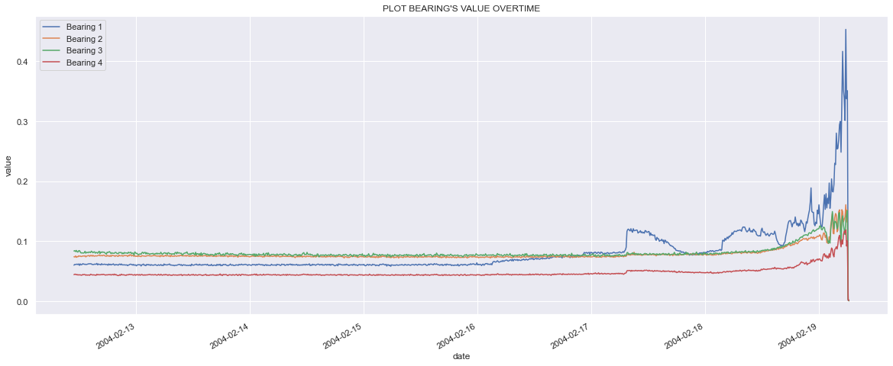
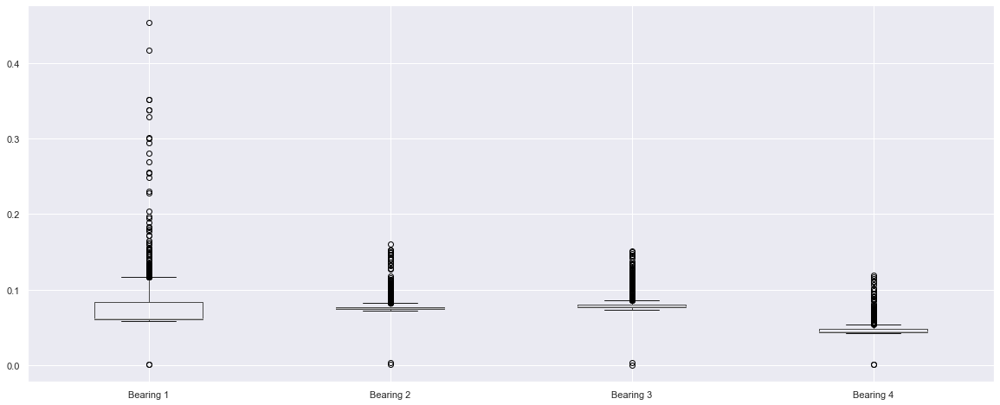
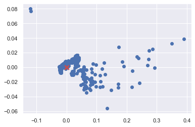
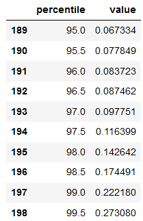
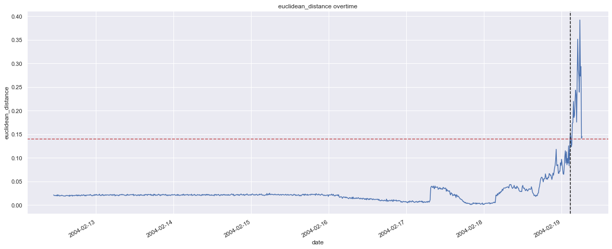
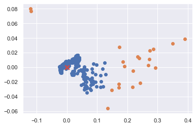
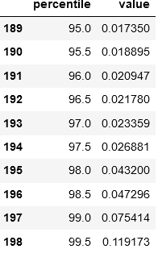
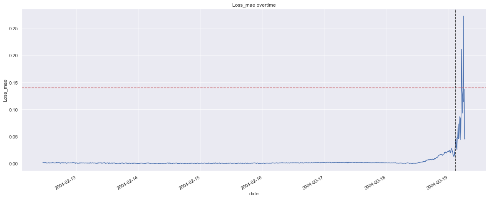
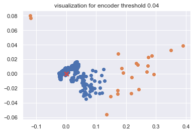
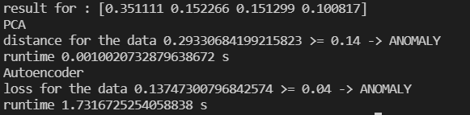

# Anomaly Detection

## Overview 
Detect anomaly based on sensor data from NASA Acoustics and Vibration Database. 

## EDA
Sensor data from 2014-02-13 till 2014-02-19 with total 982 records. Data line plot and box plot. 

From above charts seems Bearing 1 has a lot value higher than the normal value.

## Method
Here I tried 2 methods below:
<ol>
<li> Principal Components Analysis (PCA)</li>

 PCA used for dimensionality reduction, in this method we will reduce dimensionality from the features which is in this case is 4 into 2 dimesion. The 2 x 1 already represent all features from original data so it will be easier to visualize data point as (x, y). Step-step : 
    <ul>
    <li> Transform the record from 4 points into 2 points</li>
    
 Result from CPA is x and y points and this is the result if we plot it and the red mark is the centroid, we can see that some of data some how far away from others than ww will flag it as anomaly

    </img>
    <li> Check what is the distance of the record and the centroid of overall data using simple euclidean distance
    <li> Decide the threshold based on euclidiance data distribution</li>
    
based on the distribution below I took 1.4 as the threshold.

    </img>
    </ul>

Result Visualization : 

The yellow one is data that flagged as anomaly and it quite distinctfull compare to other points.

    
<li> Autoencoder</li>

This algorithm will tried to reconstruc the original value and will detect the anomaly from loss value from the network, if the loss was higher compare to other points it meaning that the data is not common and it may indicate an anomaly.
Step-step :
<ul>
<li>Define the model architecture and fit the data with X = features and y = X
<li>Check the mean loss from the network output and the original data values
<li>Check the distribution of loss values to define the threshold (9n here I used 0.04 as the threshold)

</img>

Result Visualization : 

</ol>

The result both between PCA and autoencoder is quite same, but if we see the image below seems PCA way alot faster compare to the Autoencoder.

